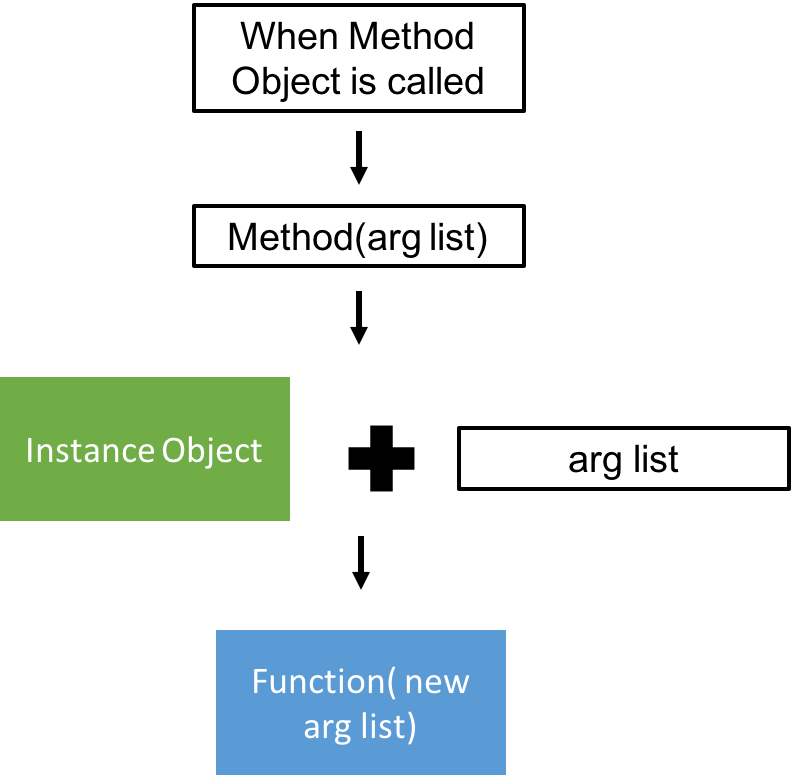

# Python Class 

kaishen, 7 Mar, 2018

Standard doc can be found [here](https://docs.python.org/3/tutorial/classes.html). 

## Some Key point

> By definition, all attributes of a class that are function objects define corresponding methods of its instances. So in our example, `x.f` is a valid method reference, since `MyClass.f` is a function, but `x.i` is not, since `MyClass.i` is not. But `x.f` is not the same thing as `MyClass.f` — it is a *method object*, not a function object.

Also, this sentence would be help.

> When an instance attribute is referenced that isn’t a data attribute, its class is searched. If the name denotes a valid class attribute that is a function object, a method object is created by packing (pointers to) the instance object and the function object just found together in an abstract object: this is the method object. When the method object is called with an argument list, a new argument list is constructed from the instance object and the argument list, and the function object is called with this new argument list.

A schema is shown like this:




Also, if you don't understand what this sentence is talking about

> Because methods have no special privileges when calling other methods of the same object, a method of a base class that calls another method defined in the same base class may end up calling a method of a derived class that overrides it. (For C++ programmers: all methods in Python are effectively virtual.)

Just look at this [link](https://stackoverflow.com/questions/41236190/how-do-overridden-method-calls-from-base-class-methods-work/41236302).

## Code Snippet

```python

"""Quite important site
https://docs.python.org/3/tutorial/classes.html
"""

class MyClass:
    """A simple example clasee"""
    i = 12345
    def f(self):
        return "hello world."

x = MyClass()

#point 1: x.f is not the same as MyClass.f
print(hex(id(MyClass)))
print(MyClass.f)
print(hex(id(MyClass.f)))
# this will cause error cause there is no instance object given
#print(MyClass.f())
print(x.f)
print(x)
```

The result is shown here

```
0x101c039d8
<function MyClass.f at 0x10453bb70>
0x10453bb70
<bound method MyClass.f of <__main__.MyClass object at 0x104106470>>
<__main__.MyClass object at 0x104106470>
```


## Calling base class's method from child class

Can see this [link](https://stackoverflow.com/questions/4747397/calling-base-class-method-in-python?rq=1)