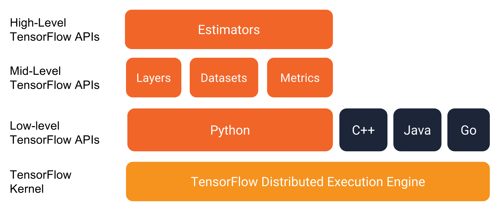

# TensorFlow 

kaishen, 9 Mar, sickness is getting better

Although I know how to write TF, but there is no overview picture of TF in my mind. I try to arrange the code and conclude it and make this note.

From many links, like [this](https://www.tensorflow.org/get_started/premade_estimators), you can see this picture. 

For now, no need to be confused, just accept this. So far, I have just used the Python API and Estimators API. Based on the TF standard docs:

> - [Estimators](https://www.tensorflow.org/programmers_guide/estimators), which represent a complete model. The Estimator API provides methods to train the model, to judge the model's accuracy, and to generate predictions.

