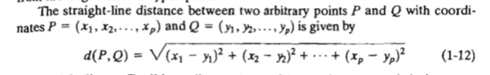
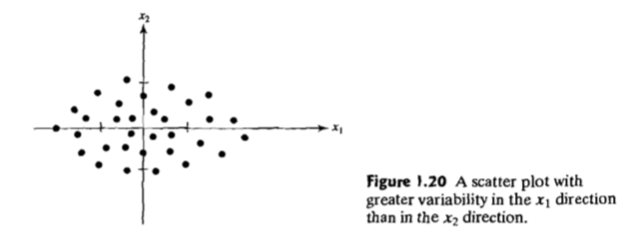
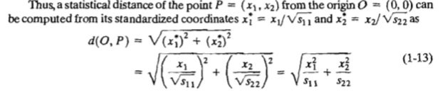
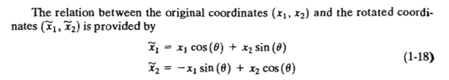
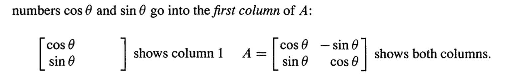
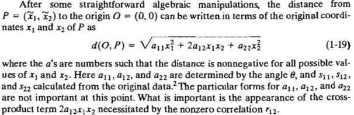
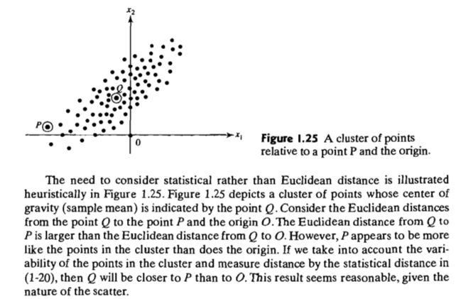

# Distance in Statistics

kaishen, Apr 16, 2018

Currently, I am reading this statistics  [book](https://www.amazon.com/Applied-Multivariate-Statistical-Analysis-Richard/dp/8120345878/ref=sr_1_1?s=books&ie=UTF8&qid=1523349380&sr=1-1&keywords=Applied+Multivariate+Statistical+Analysis%2C+by+Richard+A.+Johnson). In the first chapter, it mentions about distance. At first glance, I thought it might be just Euclidean distance or something like that. 

However, when I go forward, I find the "distance" is just not so easy and come back to this chapter.

**This is the normal distance, which is very familiar**

So why I said i miss out something? In this book, it mentions that

> Euclidean distance is unstatisfactory for most of statistical purpose. Because each coordinate contributes **equally** to the calculation of E-distance. 
>
> High variance coordinate should be weighted less heavily.  low variance coordinate should be more important. We can called this new distance "Statistical Distance".
>
> Page 30

Use this data as an example

**Option possible: Standardize** 

Till now, I gain more insight why we need to standardize when performing the ML algorithm. Actually, it is related to the **distance**. One of the Statistical distance can be:

In this book, it's rotation equation is somewhat strange at first glance. Compare these two.

While this is the standard rotation matrix

**The gist is that, the former rotates the axis while the latter rotates the vector. So the former is actually the $-\theta$.** 

Back to the topic, it is said that after some algebraic manipulation, the distance equation can be transformed into this equation:

So, indtroducing this concept, will lead us straightforward to the usage of **positive-definite matrix**.

Finally, we can get to see the below example and gain more sense why the statistical distance is more important than Euclidean distance.

